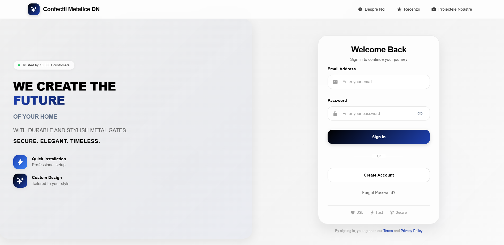
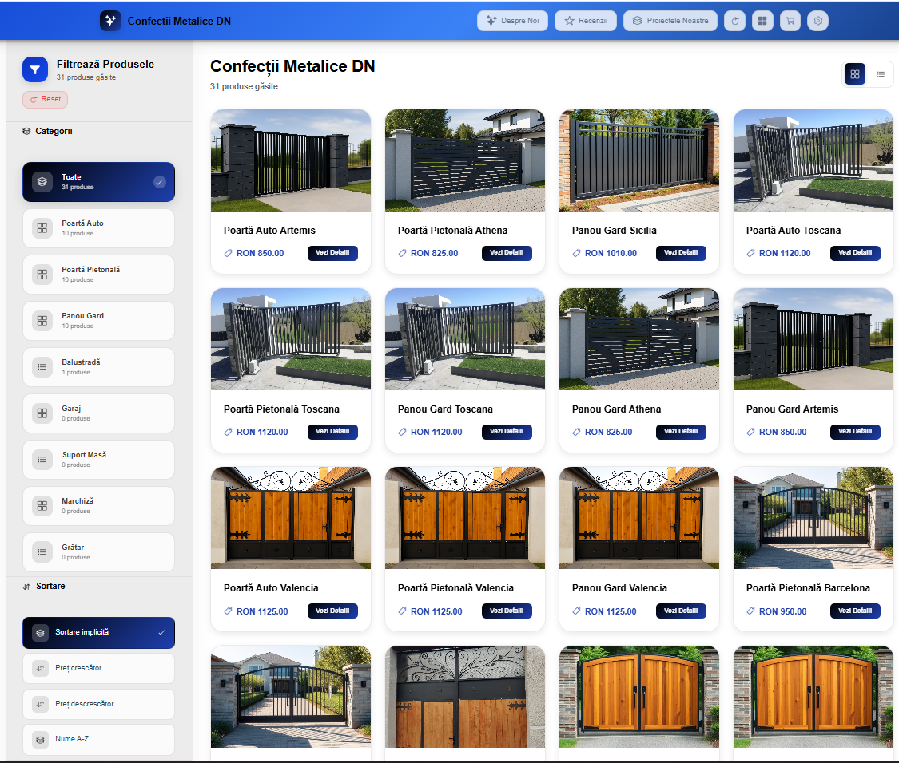
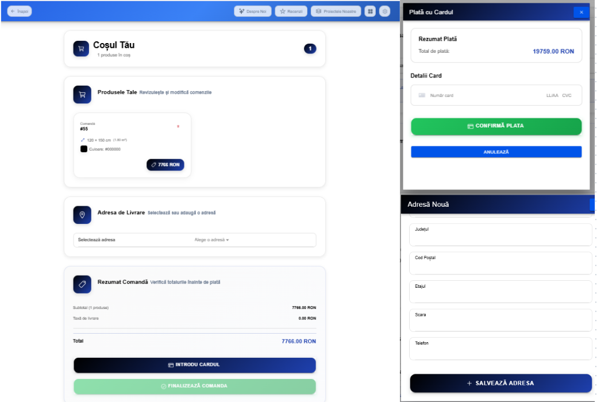
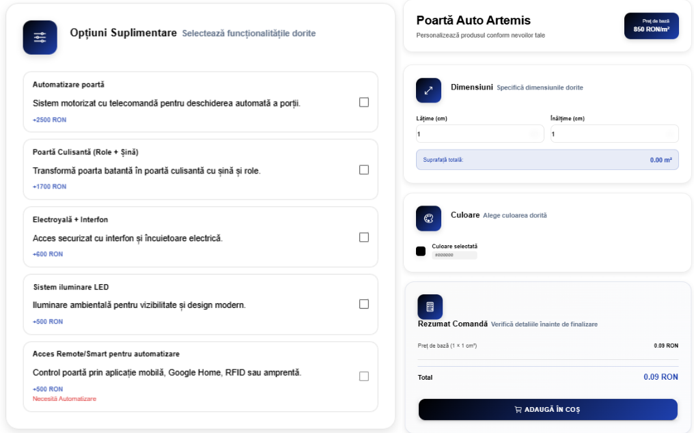
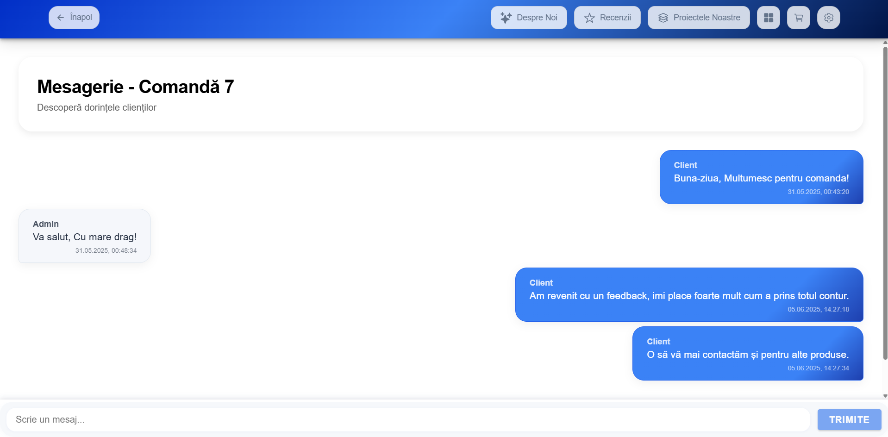
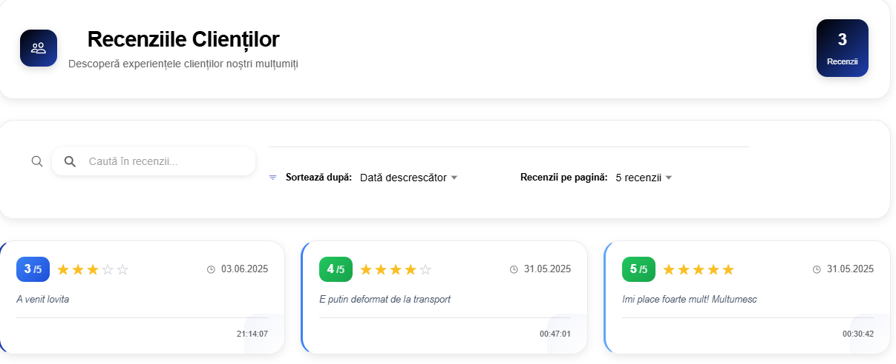
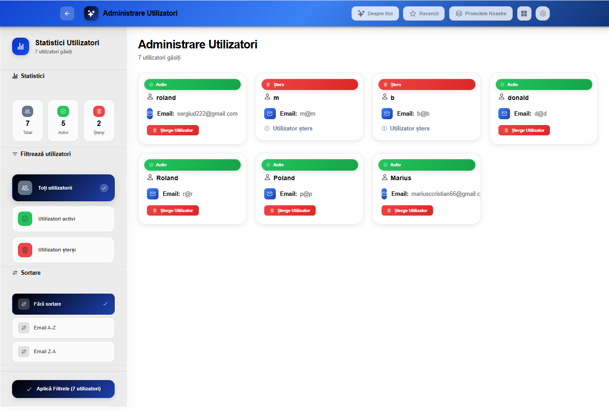
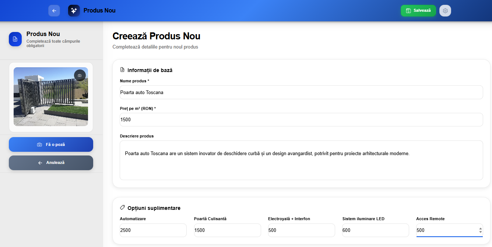
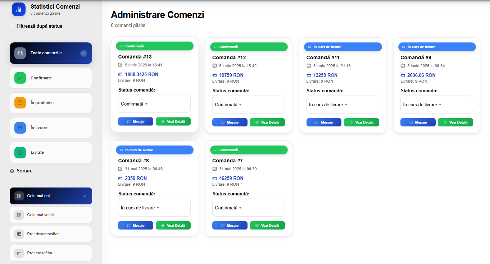
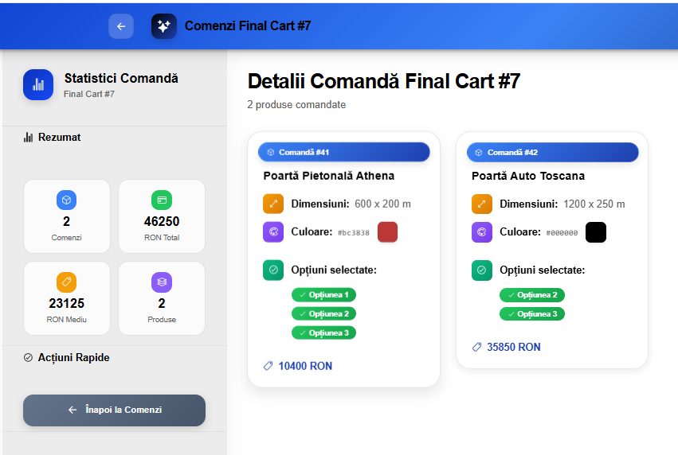

GateConfiguration is a modern web application for configuring and ordering custom metal gates and fences online. Designed for both customers and administrators, the app streamlines the entire ordering process—from price estimation to payment and delivery address selection.
## 🛠️ Main Features
- **User authentication** (Sign up, Login, Password recovery)
- **Browse and filter products** with customizable options
- **Instant price calculation** based on dimensions and selected features
- **Order placement** with selection of delivery address (integrated with OpenRouteService for delivery cost)
- **Custom orders** with image upload for personalized requests
- **Stripe integration** for secure online payments
- **Order history** and real-time status updates
- **Leave and edit reviews** after order completion
- **Admin panel** for product management, user moderation, and order status updates
- **Responsive design** for mobile and desktop use

## 📷 Screenshots

## 🧩 Tech Stack
- **Frontend:** Ionic React, TypeScript
- **Backend:** Node.js, Koa.js
- **Database/Auth:** Supabase
- **Payments:** Stripe
- **Maps/Delivery:** OpenRouteService, Nominatim
- **Deployment:** Netlify (frontend), Render (backend)

## 👨‍💻 Project Motivation
The need for custom metal products (gates, fences, canopies) has grown with the rise of online commerce, especially post-COVID-19. GateConfiguration was built to offer customers fast, transparent, and personalized price quotes, allowing them to order tailored products without back-and-forth emails or calls.

## ℹ️ Contact
For questions, suggestions, or collaboration opportunities:
- Email: sergiud222@email.com
- LinkedIn: [Sergiu Roland David](https://www.linkedin.com/in/sergiu-roland-david-04b462271/)
